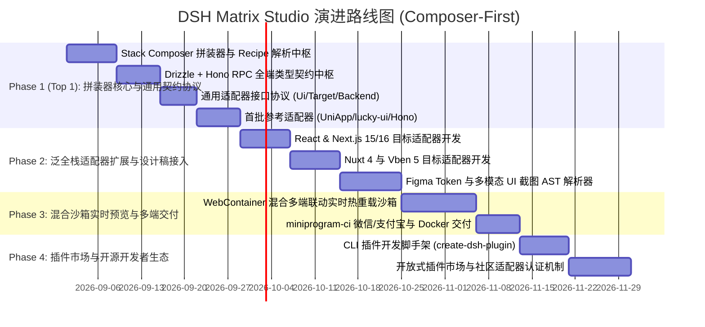

# DSH Matrix Studio 开发演进路线图与阶段任务 (Roadmap)

> **文档版本**: v1.2.0 (拼装器优先与生态开放版)
> **核心优先级策略**: **Top 1 优先构建技术栈拼装器（Stack Composer）中枢与通用插件协议**，随后通过首批开源参考适配器（Vue/React/UniApp/lucky-ui/Next.js/Hono）验证多端通用性，最后打造多端混合沙箱与插件市场。

---

## 1. 演进路线甘特图

---

## 2. 阶段详细任务分解与验收标准

### Phase 1 (Top 1): 技术栈拼装器中枢与标准插件协议 (M1)
- [ ] **Task 1.1**: 新建 `packages/matrix/composer`，实现 `ctx.matrixComposer` 核心服务，支持加载与解析任意自定义 `stack.recipe.yml`。
- [ ] **Task 1.2**: 新建 `packages/matrix/contract`，实现框架无关的 Drizzle Schema -> TypeBox -> Hono RPC 统一契约生成。
- [ ] **Task 1.3**: 确立 `UiKitAdapter`、`TargetAdapter`、`BackendAdapter` 标准插件接口规范。
- [ ] **Task 1.4**: 实现首批参考适配器（`adapters-ui/lucky-ui`、`adapters-target/uniapp`、`adapters-backend/hono`），验证全链路跑通。
- **🎯 验收标准**：通过 CLI 或配置选定积木，即可由 Agent 动态自适应生成一套符合所选规范、前后端类型打通的纯净工程。

### Phase 2: 泛全栈生态适配器与多模态设计稿解析 (M2)
- [ ] **Task 2.1**: 新建 `adapters-target/nextjs` 与 `adapters-ui/shadcn-react`，验证 React 19 / Next.js 极速扩展能力。
- [ ] **Task 2.2**: 新建 `adapters-target/nuxt4` 与 `adapters-target/vben5`，覆盖 PC SSR 与企业中后台场景。
- [ ] **Task 2.3**: 新建 `packages/matrix/ingest`，实现 Figma API 与 Vision 多模态模型转中立 Layout AST。
- **🎯 验收标准**：无论是输入 Vue 需求还是 React 需求，无论是手写提示词还是上传设计图，系统均能精准派发给对应适配器输出源码。

### Phase 3: 浏览器内混合沙箱实时预览与自动化交付 (M3)
- [ ] **Task 3.1**: 新建 `packages/matrix/preview`，集成 WebContainer API，在浏览器内并行运行多端热重载视口。
- [ ] **Task 3.2**: 新建 `packages/matrix/delivery`，集成 `miniprogram-ci` 与 Dockerfile 自动构建。
- **🎯 验收标准**：在 Web 界面中可视化点选技术栈、实时查看各端渲染效果，一键生成微信体验版二维码。

### Phase 4: 开发者生态与插件市场 (M4)
- [ ] **Task 4.1**: 发布 `@deepseek-ai/create-dsh-plugin` 脚手架工具，帮助第三方开发者 5 分钟内为自己的组件库或框架编写 DSH 适配器。
- [ ] **Task 4.2**: 建立插件市场索引，开发者可通过 `dsh plugin add <package>` 自由安装社区贡献的组件库与目标适配器。
- **🎯 验收标准**：第三方开源作者能够独立为平台编写并发布组件库插件，形成繁荣的开源生态。
